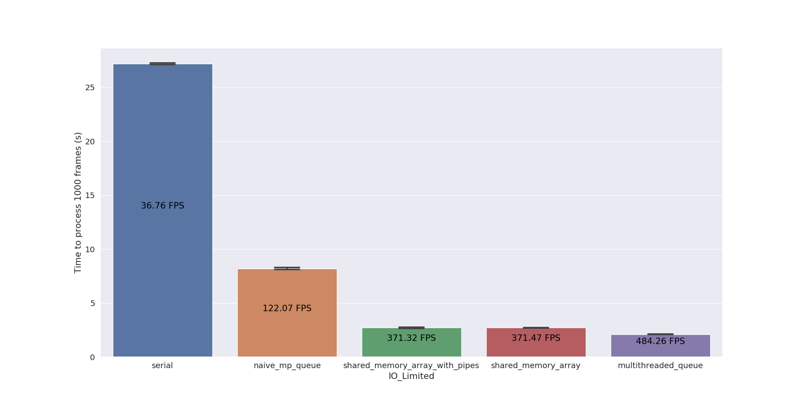
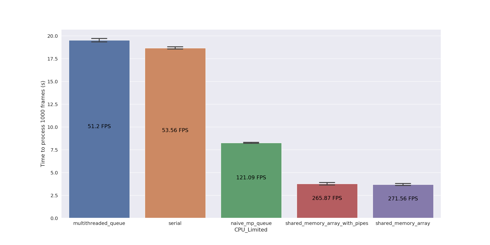

# Benchmarking communication of numpy arrays between Python processes 

https://benjamin-lowe.medium.com/using-numpy-efficiently-between-processes-1bee17dcb01

Tested using Python 3.7.0 on Ubuntu 20.04 LTS with Intel(R) Core(TM) i7-7700HQ CPU @ 2.80GHz (4-core, 8-thread CPU)   

This repo compares the following methods for sharing numpy arrays between threads/processes in order of slowest to fastest for a I/O bound task ("demo application benchmark"):

**IO Limited producer for "demo_application_benchmarking"**

1. Serial baseline
2. Simple mp.Queue (serialising and pickling the data into a queue)
3. mp.Array (shared memory) with mp.Queue for metadata
4. mp.Array (shared memory) with mp.Pipe for metadata
5. threading.Thread with queue.Queue for sharing arrays.

**CPU Limited producer for "demo_application_benchmarking"**

And for sharing numpy arrays between threads/processes in order of slowest to fastest for a CPU bound task ("demo application benchmark"):

6. threading.Thread with queue.Queue for sharing arrays.
1. Serial baseline 
2. Simple mp.Queue
4. mp.Array (shared memory) with mp.Queue for metadata
5. mp.Array (shared memory) with mp.Pipe for metadata

In these benchmarks, when a `time.sleep()` is used on the Producer it is a good emulation of I/O bound Producer because, like with an I/O bound task, the CPU is available for computation. In this situation, multithreaded code can simply allow another thread to do useful work whilst the sleep is occuring on one thread. As a result, multithreading outperforms the multiprocessing speed when `time.sleep()` is used. In contrast, when emulating CPU intensive Producer, the multiprocessing code outperforms the multithreaded code as expected.

Two benchmarks are implemented:

1. ("queue_benchmarking") Passing an image numpy array from a single producer to a single consumer
    * A (240, 320) array over 1000 frames
    * `time.sleep()` is used for the Producer, so benchmarks are all I/O bound
2. ("demo_application_benchmarking") Passing an image numpy array from many producers to a single consumer, which could then go on to, for example, stich the images into a real-time grid using simple serial numpy operations. 
    * A (240, 320) array from 16 producers to a single consumer over 1000 frames.
    * The Producer can be configured to use either `time.sleep()` or a CPU intensive calculation using the `is_io_limited` flag.
    * The producer also passes some metadata relevant to the frame, which for example, could be a timestamp of the frame.

I also included some implementations of demo application with the [Ray library](https://docs.ray.io/en/latest/index.html). I include a queue implementation that was quite slow, and a "put/get" implementation into shared memory which was fast, but does not deliver the frames in chronology, so would need an additional sorting step to obtain the same result. It also likely requires some more careful memory management, as the current implementation (ray_put_v2.py) with 16 processes, the shared memory capacity is quickly reached.

I also included an implementation attempt using https://github.com/portugueslab/arrayqueues and when it worked it was slower than the mp.Array approaches described here and faster than the simple mp.Queue, but  I did not include it by default as often it would run out of memory. I expect this issue is related to the `del` function not cleanly freeing up memory for their custom arrayqueue class.

## How To Run 

`pip install requirements.txt`

`pip install -e setup.py`

`python array_benchmark/demo_application_benchmarking/main.py`

`python array_benchmark/queue_benchmarking/main.py`

## Output

Timings can be found in the ./timings folder.

Timings are reported over 1000 frames as `time_for_all_frames` (seconds) +/- `stddev_for_all_frames` (seconds)  with this standard deviation calculatied over 3 repeats. `time_per_frame` is calculated as `time_for_all_frames`/1000 and the FPS is calculated as 1/`time_per_frame`.

## Notes

Note that this approach will not work when processes are set to "spawn" mode (i.e. on windows) as per discussion [here](https://github.com/bml1g12/benchmarking_multiprocessing_np_array_comms/issues/4). 
